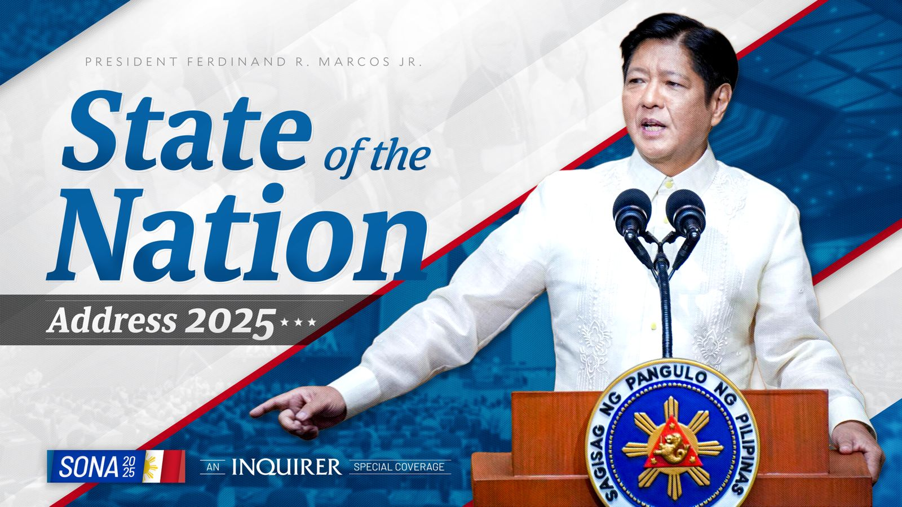

# Take on SONA July 2025 of Pres. Ferdinand R. Marcos Jr.
### by Avery Ababon, 9-Cesium

 

## Things I found interesting:
1.) Unemployment has lowered by 4%.  
2.) There is a rollout of African Swine Fever vaccine. 
3.) The revival of the "Love Bus". 

## Things I found weird:
1.) The support for micro-enterprises 
2.) Free dialysis. 
3.) The plan to give free SIM cards for remote communities. 

## Reflection:
In the SONA 2025, Bong-Bong Marcos talked about the different projects in the Philippines.  One of these include the offering of free dialysis and kidney transplants for people in need. For education, more than 22 thousand classrooms have been built, and internet access for all public schools has been implemented.

In my opinion, I feel like the new things President Marcos has implimented for the Philippines will help the people benefit, especially the children because there is now a focus on helping strengthen education. I like how they provided more classrooms to help more people learn. Meanwhile, I think it is a good thing that the Philippines has strengthened it's alliance with some countries such as America and Japan, since if a war were to happen, we would have allies. To summarize it, I think that news delivered in the SONA will help the country become a better place.

